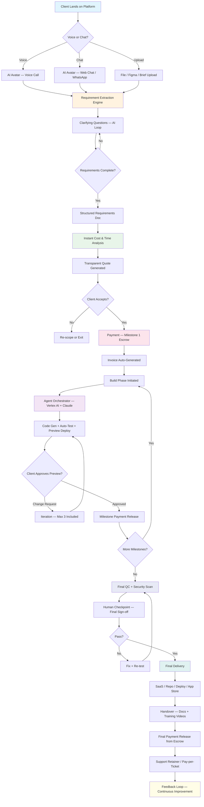

# Naledi AI Software Factory — End-to-End Workflow Design

**Version:** 1.0  
**Date:** 2026-04-24  
**Market:** South Africa (SMEs, Restaurants, Marketing Agencies)  
**Benchmark:** International AI Software Factory Leaders  

---

## 1. Executive Summary

Naledi is a fully-automated AI software factory designed for the South African market. It combines voice + chat AI avatars, automated cost estimation, milestone-based payments, agentic code generation, and integrated delivery pipelines. The workflow is optimized for low-touch, high-trust engagements with SMEs that have limited technical staff but need production-grade software.

**Key Design Principles:**
- **Trust-first:** Transparent pricing, escrow-backed payments, human checkpoints only at payment and final sign-off.
- **Low friction:** Voice-first onboarding in English, isiZulu, isiXhosa, and Afrikaans.
- **Local context:** Integrates PayFast, Paystack, and FNB APIs. Understands SARS compliance, POPIA, and BEE requirements.
- **Speed:** From brief to deployed MVP in 48–72 hours for standard projects.

---

## 2. Mermaid Workflow Diagram



---

## 3. Stage-by-Stage Operational Playbook

---

### Stage 1: Discovery & Onboarding

#### 1.1 Entry Points
| Channel | Description | Tech Stack |
|---|---|---|
| Web Landing | Branded landing with CTA to start project | Next.js, Vercel Edge |
| WhatsApp | Click-to-chat on mobile, widely used in SA | WhatsApp Business API (via 360dialog or Meta) |
| Voice Call | AI avatar answers a local SA number | Bland AI / Retell / Twilio + ElevenLabs |
| File Upload | Drag-and-drop from landing or chat | GCP Cloud Storage + Document AI |
| Figma Link | Paste URL, AI scrapes design | Figma REST API + Agent parser |

#### 1.2 AI Avatar Behavior
- **Multilingual:** Primary English, with isiZulu, isiXhosa, Afrikaans fallback.
- **Persona:** Professional, warm, local context-aware (knows SA business rhythms, load-shedding concerns, mobile-first usage).
- **Voice:** Female or male selectable. Accent: neutral SA English.
- **Duration:** Onboarding call designed for 8–12 minutes.

#### 1.3 Input Parsing

**Voice/Chat Input:**
1. Transcribe via Whisper API (multilingual).
2. Extract entities using Gemini/Claude:
   - Business type, size, industry
   - Pain points and goals
   - Feature requests (structured into epics)
   - Existing systems (POS, accounting, CRM)
   - Timeline expectations
   - Budget ceiling (soft probe)
3. Generate follow-up questions to fill gaps.

**File Upload (PDF, DOCX, PNG):**
1. OCR + layout analysis via Document AI.
2. Extract: user stories, wireframes, brand assets, compliance requirements.
3. Cross-reference with SA-specific templates (restaurant, agency, retailer).

**Figma Link:**
1. Authenticate via Figma OAuth.
2. Parse frames into component hierarchy.
3. Extract color palette, typography, spacing tokens.
4. Flag accessibility issues (contrast ratios, font sizes).

#### 1.4 Output: Structured Requirements Document
```json
{
  "project_id": "naledi-2026-04-abc123",
  "client": { "name", "business_type", "size", "location" },
  "discovery": {
    "pain_points": [],
    "goals": [],
    "success_metrics": []
  },
  "requirements": {
    "epics": [
      {
        "id": "E1",
        "title": "Online Ordering System",
        "user_stories": [],
        "acceptance_criteria": [],
        "complexity": "medium",
        "estimated_hours": 16
      }
    ]
  },
  "integrations": ["PayFast", "Yoco", "WhatsApp Business"],
  "compliance": ["POPIA", "PCI-DSS (lite)"],
  "design": { "figma_url", "brand_assets", "theme_tokens" },
  "timeline": { "target_date", "phases": [] },
  "risks": ["Third-party API instability", "Client delay on assets"]
}
```

---

### Stage 2: Instant Cost & Time Analysis

#### 2.1 Pricing Philosophy
South African SMEs are price-sensitive and risk-averse. The model must feel predictable and fair.

**Formula: Hybrid Feature + Complexity Tier**

```
Total Price = Base Platform Fee + Σ(Feature Cost × Complexity Multiplier) + Integration Surcharge + Rush Fee

Where:
- Base Platform Fee = R 2,500 (covers project setup, hosting config, CI/CD)
- Feature Cost per Epic = lookup table (see below)
- Complexity Multiplier:
  - Simple (CRUD, static pages) = 1.0×
  - Medium (auth, dashboards, basic APIs) = 1.5×
  - Complex (real-time, ML, custom integrations) = 2.5×
- Integration Surcharge = R 500 per external API
- Rush Fee = 1.3× if < 72h delivery requested
```

#### 2.2 Feature Cost Lookup (ZAR)

| Feature | Simple | Medium | Complex |
|---|---|---|---|
| Landing Page | R 1,500 | R 3,000 | R 6,000 |
| Auth (Email/Social) | R 2,000 | R 4,000 | R 8,000 |
| Dashboard / Analytics | R 3,000 | R 6,000 | R 12,000 |
| Payment Gateway | R 2,500 | R 5,000 | R 10,000 |
| Booking / Reservation | R 2,000 | R 4,500 | R 9,000 |
| CMS / Blog | R 1,500 | R 3,500 | R 7,000 |
| E-commerce Catalog | R 3,000 | R 7,000 | R 15,000 |
| Mobile App (PWA/Native) | R 4,000 | R 10,000 | R 25,000 |
| AI Chatbot Integration | R 2,000 | R 5,000 | R 12,000 |
| API + Webhooks | R 1,500 | R 4,000 | R 9,000 |

#### 2.3 Time Estimation

AI estimates are based on:
- Historical build data from similar projects (vector DB of past builds)
- Code generation speed (measured in tokens/minute + compilation success rate)
- Test generation and execution time
- Integration complexity score

**Time Formula:**
```
Estimated Days = Σ(Feature Hours × Complexity) / 6 productive hours/day × Contingency Factor

Contingency Factor:
- 1.0 for standard delivery (5–7 business days)
- 1.3 for rush (< 72h)
- 1.5 if client has > 3 third-party integrations with unknown documentation
```

#### 2.4 Quote Presentation
The client sees:
1. **Itemized breakdown** — every feature with price and day estimate.
2. **What is included:** 3 design iterations, 2 revision rounds per milestone, hosting for 30 days.
3. **What is extra:** Content writing (R 800/page), custom photography, app store submission.
4. **Payment schedule** — see Stage 3.
5. **Accept CTA** — one-click accept + digital signature (Yousign or local equivalent).

---

### Stage 3: Payment

#### 3.1 Recommended Gateway Stack for South Africa

| Gateway | Best For | Transaction Fee | Payout Time | Notes |
|---|---|---|---|---|
| **Paystack** | SMEs, recurring billing | 1.5% + R 2.50 (local) | T+1 | Excellent API, built-in subscriptions, Flutterwave acquisition stable |
| **PayFast** | E-commerce, trusted brand | 2.0% + R 2.00 | T+2 | Longest-running SA gateway, high consumer trust |
| **Peach Payments** | Enterprise, cross-border | Custom pricing | T+2 | Strong on 3D Secure, good for higher-ticket projects |
| **Stripe** | International clients, SaaS | 2.9% + $0.30 | T+2 | Best developer experience, instant escrow via Stripe Treasury (US only) |

**Recommendation:** Primary = **Paystack** (best API + pricing). Fallback = **PayFast** (brand trust). International clients = **Stripe**.

#### 3.2 Payment Model: Milestone-Based Escrow

For SA market trust-building, **milestone-based escrow is optimal**:

| Milestone | % of Total | Trigger | Release Condition |
|---|---|---|---|
| Deposit (Kickoff) | 30% | Client accepts quote | Released to Naledi upon build start |
| Build Complete (Preview Live) | 40% | AI deploys preview URL | Held in escrow until client approves preview |
| Final Delivery | 30% | Client signs off final QC | Released upon go-live + handover |

**Escrow Mechanism:**
- Use Paystack’s **Split Payment** or **Subaccount** features to hold milestone 2 in escrow.
- Alternatively, integrate with a legal escrow provider (e.g., **Safeguard** or traditional attorney escrow for high-value projects > R 100k).
- For projects < R 20k, simpler milestone invoicing without formal escrow is acceptable, but funds are only withdrawn upon milestone delivery.

#### 3.3 Automated Invoice Generation
- **Tool:** Triggered via Paystack/Stripe webhook on payment confirmation.
- **Format:** SARS-compliant tax invoice (VAT inclusive if applicable).
- **Delivery:** Email + WhatsApp PDF.
- **Ledger:** Auto-synced to Xero/QuickBooks/Zoho Books via API.

---

### Stage 4: Build Phase

#### 4.1 Agent Architecture

```
┌─────────────────────────────────────────────────────────────┐
│                    NAledi Build Orchestrator                  │
│                  (Vertex AI + Claude + Custom)                │
├─────────────────────────────────────────────────────────────┤
│  Product Manager Agent  │  Architect Agent  │  Coder Agent   │
│  (reqs → stories)       │  (tech design)    │  (code gen)    │
├─────────────────────────────────────────────────────────────┤
│  Tester Agent  │  DevOps Agent  │  Comms Agent              │
│  (auto-test)   │  (deploy)      │  (email/chat updates)     │
└─────────────────────────────────────────────────────────────┘
```

**Tech Stack:**
- **Orchestration:** Vertex AI (Google Cloud) for multi-agent coordination + Paperclip-style control plane.
- **Code Generation:** Claude 3.7 Sonnet / Claude 4 (primary), Gemini 2.5 Pro (secondary for long context).
- **Testing:** Vitest / Pytest / Playwright (auto-generated test suites).
- **Deployment:** Cloud Run (GCP) for SaaS; Vercel/Netlify for frontend; Firebase for mobile backend.

#### 4.2 Iteration Cycle

```
AI Agent generates code (2–4h)
      ↓
Auto-lint + compile + unit tests
      ↓
Deploy to preview environment (Vercel/Cloud Run)
      ↓
Send preview URL + changelog to client (WhatsApp + Email)
      ↓
Client reviews (24h SLA)
      ↓
{Approve → next milestone} OR {Change request → iteration}
```

**Iteration Policy:**
- **Included:** 3 iterations per milestone.
- **Extra iterations:** R 400/hour or R 1,500 per additional round (whichever is higher).
- **Scope creep detection:** AI flags when a change request exceeds original requirements by > 20%. Triggers a "Change Order" — new quote for delta.

#### 4.3 Milestone Communication
- **Start of milestone:** Email + WhatsApp: "We have started Milestone 2: Payment Integration. Expected preview by Thursday 14:00."
- **Preview ready:** "Your preview is live: [URL]. Here is a 2-minute Loom video walkthrough: [link]. Reply APPROVE or tell us what to change."
- **End of day update (if milestone > 2 days):** Brief status update with % complete.

---

### Stage 5: Quality Control

#### 5.1 Automated Testing Pipeline

```
Code Commit → Lint → Type Check → Unit Tests → Integration Tests → E2E (Playwright) → Security Scan → Deploy Gate
```

**Coverage Requirements:**
- Unit tests: ≥ 80% coverage (auto-generated by AI, human-reviewed at final checkpoint).
- Integration tests: All critical user flows (login → purchase → confirmation).
- E2E tests: Playwright scripts for Chrome, Safari, mobile Safari, mobile Chrome.
- Performance: Lighthouse score ≥ 90 for Performance, Accessibility, Best Practices.

#### 5.2 Security Scan & Compliance

| Check | Tool | Frequency |
|---|---|---|
| Dependency vulnerabilities | Snyk or Dependabot | Every build |
| Static code analysis (SAST) | Semgrep / CodeQL | Every build |
| Secrets scanning | GitLeaks / TruffleHog | Every commit |
| POPIA compliance check | Custom rules engine | Final delivery |
| OWASP Top 10 | ZAP baseline scan | Final delivery |

**POPIA-specific checks:**
- Consent management flows present.
- Data retention policy documented.
- Encryption at rest and in transit.
- No PII leakage in logs.

#### 5.3 Human-in-the-Loop Checkpoints

Per the user requirement: human checkpoints **only** at:
1. **Payment approval** — finance team verifies invoice accuracy before milestone funds are released.
2. **Final sign-off** — senior engineer reviews the complete deliverable, runs final security scan, and approves go-live.

**No human involvement during:** code generation, testing, preview deployment, or iteration cycles.

---

### Stage 6: Delivery & Shipping

#### 6.1 Delivery Channels

| Product Type | Delivery Method | Hosting |
|---|---|---|
| Web App / SaaS | Live URL + admin credentials | GCP Cloud Run / Firebase Hosting |
| Frontend-only | Vercel/Netlify project transfer | Client Vercel/Netlify account |
| Source Code | GitHub/GitLab repo invitation | Client repository |
| Mobile App (PWA) | Deployed to Firebase Hosting + manifest | Client domain |
| Mobile App (Native) | .aab + .ipa files + app store submission guide | Client Google Play / App Store accounts |
| WordPress / Shopify | Theme/plugin upload + config | Client hosting |

#### 6.2 Handover Package

1. **Technical Documentation**
   - Architecture diagram (auto-generated from code)
   - API documentation (OpenAPI/Swagger)
   - Environment variables and secrets list
   - Deployment runbook

2. **User Documentation**
   - Admin panel guide (AI-generated from UI screenshots)
   - End-user FAQ
   - Troubleshooting guide

3. **Training Videos**
   - Auto-generated using AI screen recording + ElevenLabs voiceover
   - 3–5 minute modules: Admin, Orders, Reports, Settings
   - Hosted on Vimeo/YouTube unlisted + embedded in client dashboard

4. **Access Transfer**
   - DNS handover checklist
   - Google Search Console verification transfer
   - Third-party API key rotation to client-owned keys

#### 6.3 Post-Delivery Support Model

**Tier 1: AI Self-Service (Included for 30 days)**
- Client chats with support AI in WhatsApp/web.
- AI can read logs, restart services, adjust configs, push hotfixes for minor bugs.
- Covers: typo fixes, color changes, content updates, minor config tweaks.

**Tier 2: Pay-Per-Ticket (Month 2 onwards)**
| Issue Type | Response Time | Price |
|---|---|---|
| Critical (site down) | 2 hours | R 1,500 |
| High (broken feature) | 8 hours | R 800 |
| Medium (cosmetic) | 24 hours | R 400 |
| Low (question/advice) | 48 hours | R 200 |

**Tier 3: Retainer (Recommended for active businesses)**
- R 3,500/month: 10 tickets + monthly security patch + 2h dev time.
- R 7,500/month: Unlimited tickets + priority queue + monthly feature release + dedicated AI agent.

---

### Stage 7: Client Communication During Build

#### 7.1 Communication Channels

| Channel | Purpose | Frequency |
|---|---|---|
| **WhatsApp Business** | Primary async chat, approvals, quick questions | Daily (as needed) |
| **Email** | Milestone summaries, invoices, formal updates | Per milestone |
| **Web Dashboard** | Real-time build progress, preview URLs, documents | Continuous |
| **Voice Call** | Complex explanations, dispute resolution | On request |

#### 7.2 Milestone Demos
- Every milestone ends with a **preview URL** deployed to a unique Vercel/Cloud Run subdomain.
- A **Loom-style AI walkthrough** is auto-generated (screen recording + voiceover).
- Client clicks **Approve** or **Request Changes** directly in the web dashboard.

#### 7.3 Complaints & Dispute Handling

**Escalation Ladder:**
1. **Level 1 — AI Mediation:** Support AI acknowledges complaint within 15 minutes, reviews project logs, and proposes resolution.
2. **Level 2 — Human Ops:** If AI cannot resolve within 24h or client explicitly requests human, a human ops manager joins the WhatsApp thread.
3. **Level 3 — Formal Dispute:** For payment or scope disputes, a mediation call is scheduled. If unresolved, the escrow arbitration clause applies (see Stage 3).

**Common Scenarios:**
- **"It does not look like the design"** → AI opens Figma diff tool, highlights deviations, offers free correction round.
- **"It is too slow"** → AI runs Lighthouse, shares report, optimizes if score < 90.
- **"I did not ask for this"** → AI retrieves requirements doc + signed quote, refers to original scope. Change orders offered for additions.
- **"I want a refund"** → If before milestone 2 delivery: full deposit refund minus R 500 admin fee. If after milestone 2: prorated refund based on completed milestones.

---

## 4. International Benchmark Comparison

### 4.1 Comparison Table: Naledi vs. Global AI Software Factories

| Dimension | **Naledi (SA-focused)** | **Devin (Cognition)** | **Factory.ai** | **Replit Agent** | **Lovable / v0** |
|---|---|---|---|---|---|
| **Primary Model** | Milestone-based AI factory | Full-stack AI engineer (autonomous) | AI-native dev agency | Cloud IDE + AI agent | Frontend AI builder |
| **Client Interaction** | AI avatar (voice + chat + WhatsApp) | GitHub issue comments, async | Slack/email, human PM | Chat inside IDE | Chat + visual editor |
| **Onboarding Depth** | Structured requirements doc, clarifying questions | Reads issue, asks minimal questions | Human-led discovery call | User prompt only | Prompt + visual refinement |
| **Pricing Transparency** | Instant itemized quote | Opaque (enterprise sales) | Project-based estimate | Subscription (Replit Core) | Subscription tiers |
| **Pricing Model** | Fixed per feature × complexity | Not public (presumed $10k–$100k+) | Project-based, human-AI hybrid | $7–$25/month + compute | $20–$50/month |
| **Payment Structure** | Milestone escrow (30/40/30) | Enterprise contract / retainer | Milestone or retainer | Monthly subscription | Monthly subscription |
| **Payment Gateways** | Paystack, PayFast, Peach, Stripe | Stripe (US focus) | Stripe, wire transfer | Stripe | Stripe |
| **Build Orchestration** | Vertex AI multi-agent (PM, Architect, Coder, Tester) | Single autonomous agent | Human PM + AI engineers | Single agent in IDE | Single agent |
| **Testing** | Auto-generated unit + E2E, security scan | Self-testing, but limited public info | Human QA + AI tests | Basic lint/run | Basic preview |
| **Human Involvement** | Payment + final sign-off only | Human review at PR stage | High (human PMs, designers) | Minimal | Minimal |
| **Delivery Method** | SaaS hosted, repo transfer, Vercel/Netlify, app stores | GitHub PR | Managed hosting | Replit deployment | Vercel/Netlify |
| **Post-Delivery Support** | AI self-service + pay-per-ticket + retainer | Not a core offering | Retainer / support contracts | Community / Discord | Community / Discord |
| **Localization** | SA-focused: POPIA, BEE, multi-language, local payments | US/global | US/global | Global | Global |
| **Time to MVP** | 48–72h (standard) | Hours to days (single task) | Days to weeks | Minutes to hours | Minutes to hours |
| **Target Market** | SA SMEs, restaurants, agencies | Enterprise, funded startups | SMB to Enterprise | Hobbyists to pro devs | Designers, indie hackers |
| **Trust Mechanism** | Milestone escrow + transparent quote + local payment brands | Brand reputation + enterprise contract | Human relationship | Low barrier to try | Low barrier to try |

### 4.2 Key Differentiators Learned from International Players

**From Devin:**
- **Lesson:** Autonomous agents can handle complex tasks, but clients need visibility. Devin is opaque — Naledi solves this with milestone previews and constant communication.
- **Adopt:** Deep reasoning capabilities for architecture decisions.
- **Avoid:** Lack of pricing transparency; clients in SA need to know costs upfront.

**From Factory.ai:**
- **Lesson:** Hybrid human-AI models build trust but are expensive to scale.
- **Adopt:** Structured project management and milestone discipline.
- **Avoid:** Heavy human PM overhead — Naledi replaces this with an AI PM agent + human checkpoints.

**From Replit Agent:**
- **Lesson:** Instant gratification (deploy in minutes) is powerful for conversion.
- **Adopt:** One-click preview deployments and live iteration.
- **Avoid:** Subscription-only model — SA clients prefer project-based billing.

**From Lovable / v0:**
- **Lesson:** Visual refinement loops (chat → preview → tweak) are intuitive.
- **Adopt:** Visual diff and direct manipulation for design feedback.
- **Avoid:** Limitation to frontend-only; Naledi offers full-stack + backend + integrations.

---

## 5. SA-Specific Market Adaptations

### 5.1 Why This Workflow Wins in South Africa

| SA Market Reality | Naledi Adaptation |
|---|---|
| SMEs are cash-flow sensitive | Milestone payments reduce upfront risk |
| High mobile usage (> 70%) | WhatsApp-first communication, mobile-optimized previews |
| Load shedding affects business hours | Async-first workflow, no dependency on real-time co-working |
| Trust issues with offshore devs | Local phone numbers, SA payment gateways, human escrow |
| POPIA compliance required | Built-in compliance checks in QC pipeline |
| BEE procurement preferences | Naledi can be structured as 51% black-owned, offering BEE certificates |
| Multiple official languages | AI avatar speaks English, isiZulu, isiXhosa, Afrikaans |
| Limited technical staff | Zero client technical knowledge required; full handover included |

### 5.2 Competitive Pricing vs. Traditional SA Agencies

| Service | Traditional Agency (Cape Town/JHB) | Naledi AI Factory |
|---|---|---|
| 5-page business website | R 15,000 – R 35,000 | R 5,000 – R 8,000 |
| Restaurant ordering system | R 40,000 – R 80,000 | R 12,000 – R 20,000 |
| Marketing agency client portal | R 60,000 – R 120,000 | R 18,000 – R 30,000 |
| E-commerce store (SaaS) | R 50,000 – R 150,000 | R 15,000 – R 40,000 |
| Time to delivery | 4–8 weeks | 48h – 7 days |

---

## 6. Risk Register

| Risk | Likelihood | Impact | Mitigation |
|---|---|---|---|
| AI generates insecure code | Medium | High | Mandatory SAST + secrets scan + human final checkpoint |
| Client scope creep | High | Medium | AI change-order detection, clear iteration limits |
| Payment gateway downtime | Low | High | Multi-gateway fallback (Paystack → PayFast) |
| Client dissatisfaction with AI output | Medium | High | 3 included iterations, human mediation at Level 2 |
| POPIA non-compliance | Low | Critical | Automated compliance checks in pipeline |
| Load shedding during build | Medium | Low | Cloud-based build agents unaffected; comms async |
| International competitor enters SA | Medium | High | Local trust, language, payment integration moat |

---

## 7. Success Metrics (KPIs)

| Metric | Target |
|---|---|
| Quote-to-project conversion rate | > 35% |
| Client satisfaction (NPS) | > 50 |
| Milestone on-time delivery | > 90% |
| Average project delivery time | < 5 days |
| Post-delivery bug rate | < 2 critical bugs per project |
| Support ticket resolution (AI-only) | > 70% |
| Client repeat business rate | > 40% within 12 months |
| Refund/dispute rate | < 5% |

---

## 8. Appendix: Technology Reference Stack

| Layer | Technology |
|---|---|
| Frontend | Next.js 15, Tailwind CSS, shadcn/ui |
| Backend | Node.js / Python (FastAPI), Cloud Run |
| Database | PostgreSQL (Cloud SQL), Firestore (for real-time) |
| AI/ML | Vertex AI (Gemini), Claude (Anthropic API), Whisper |
| Voice | Bland AI / Retell / Twilio + ElevenLabs |
| Chat | WhatsApp Business API, custom web chat (Socket.io) |
| CI/CD | Cloud Build, GitHub Actions |
| Hosting | GCP (primary), Vercel/Netlify (frontend) |
| Storage | Cloud Storage, Firebase Storage |
| Monitoring | Cloud Monitoring, Sentry, LogRocket |
| Payments | Paystack (primary), PayFast (fallback), Stripe (intl) |
| Docs / Videos | Mintlify (docs), Synthesia / Loom (videos) |

---

*Document generated for the Naledi AI Software Factory initiative. Benchmarked against Devin (Cognition Labs), Factory.ai, Replit Agent, and Lovable/v0.*