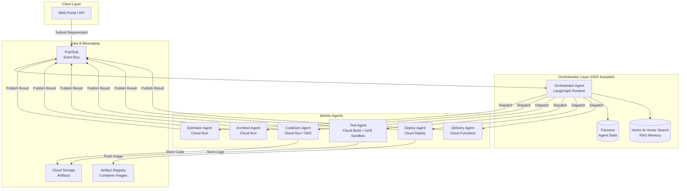
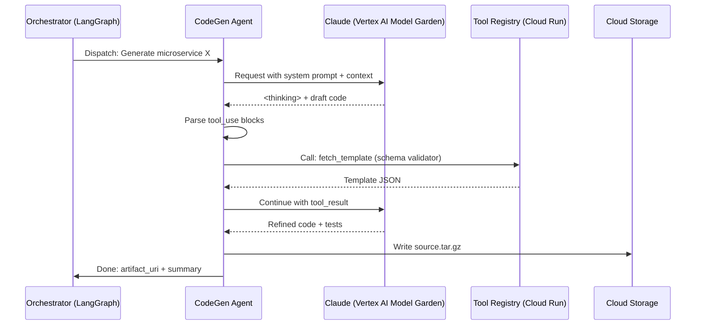
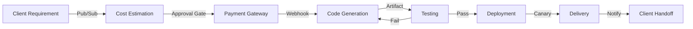
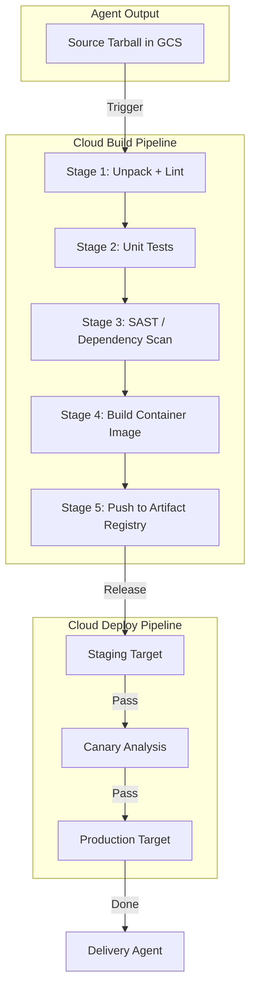
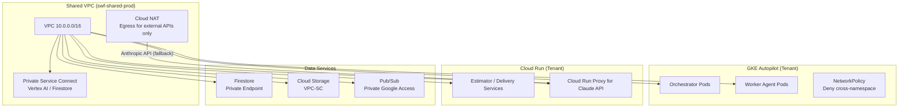
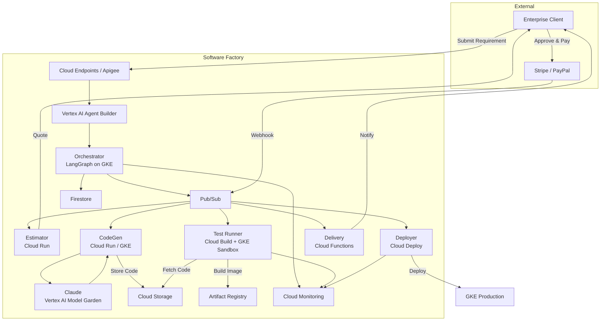
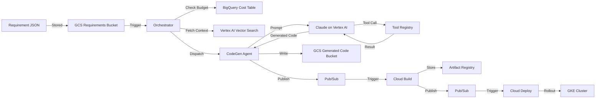
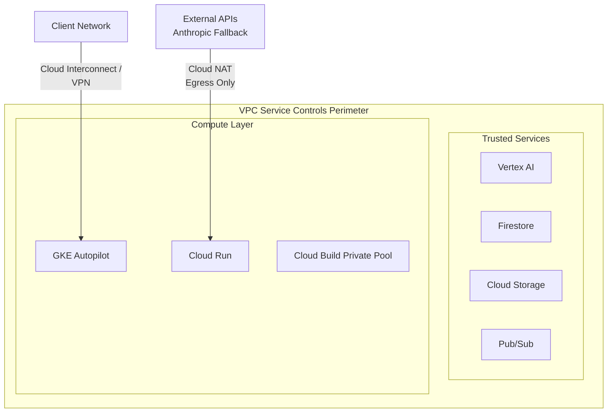

# Enterprise Software Factory Architecture Report
## Google Cloud Vertex AI × Claude SDK — Fully-Automated Multi-Agent System

**Date:** 2026-04-24  
**Scope:** Design a production-grade, automated software factory leveraging Google Cloud Vertex AI for agent orchestration and Anthropic Claude for code generation and reasoning.

---

## Table of Contents
1. [Executive Summary](#1-executive-summary)
2. [Vertex AI Architecture for Agent Orchestration](#2-vertex-ai-architecture-for-agent-orchestration)
3. [Claude SDK Integration](#3-claude-sdk-integration)
4. [End-to-End Pipeline Architecture](#4-end-to-end-pipeline-architecture)
5. [Security & Isolation](#5-security--isolation)
6. [Observability & Cost Control](#6-observability--cost-control)
7. [CI/CD for Agent-Generated Code](#7-cicd-for-agent-generated-code)
8. [Recommended GCP Project Structure](#8-recommended-gcp-project-structure)
9. [Service Mapping Matrix](#9-service-mapping-matrix)
10. [Appendix: Mermaid Architecture Diagrams](#10-appendix-mermaid-architecture-diagrams)

---

## 1. Executive Summary

This report defines the technical architecture for an enterprise **Software Factory** — a fully-automated system that ingests client requirements, estimates cost, processes payment, generates code via AI agents, validates through automated testing, deploys to production, and delivers the artifact. The architecture couples **Google Cloud Vertex AI** (orchestration, custom model serving, agent runtime) with **Anthropic Claude** (code generation, multi-turn reasoning, long-context synthesis).

### Key Design Principles
- **Event-Driven**: Pub/Sub decouples all pipeline stages.
- **Serverless-First**: Cloud Run and Cloud Functions handle variable agent workloads.
- **Tenant Isolation**: Each client workload is isolated via GKE namespaces, VPC-SC, and IAM conditions.
- **Human-in-the-Loop (HITL)**: Optional approval gates at cost estimation and deployment stages.
- **Immutable Artifacts**: All generated code, build images, and deployment manifests are versioned in Cloud Storage / Artifact Registry.

---

## 2. Vertex AI Architecture for Agent Orchestration

### 2.1 High-Level Agent Runtime

A multi-agent software factory requires a control plane (orchestrator) and multiple specialized worker agents. On GCP, the recommended stack is:

| Layer | GCP Service | Purpose |
|-------|-------------|---------|
| **Agent Control Plane** | Vertex AI Agent Builder + Custom Runtime on GKE Autopilot | Orchestrates agent DAGs, maintains state, handles retries |
| **Agent Workers** | Cloud Run (stateless) / GKE Autopilot (stateful/long-running) | Executes individual agent tasks (e.g., code generation, test runner) |
| **State & Memory** | Firestore (agent state) + Vertex AI Vector Search (RAG memory) | Persistent multi-turn context and retrieval-augmented generation |
| **Messaging Bus** | Pub/Sub | Async inter-agent communication and pipeline events |
| **Artifact Store** | Cloud Storage (GCS) | Stores generated code, build artifacts, logs |

### 2.2 Agent Topology

We recommend a **hub-and-spoke** topology managed by a LangGraph runtime on GKE:

- **Orchestrator Agent** (LangGraph on GKE Autopilot): Parses requirements, decomposes work, dispatches tasks.
- **Estimator Agent** (Cloud Run): Analyzes complexity, queries historical data in BigQuery, returns effort/cost.
- **Architect Agent** (Cloud Run + Vertex AI): Generates high-level design docs and service blueprints.
- **CodeGen Agent** (Cloud Run / GKE): Calls Claude SDK to produce source code. Runs in isolated Cloud Workstations for long-running generation.
- **Test Agent** (Cloud Build + GKE sandbox): Executes unit, integration, and security scans.
- **Deploy Agent** (Cloud Deploy + Cloud Run/GKE): Manages canary/blue-green rollouts.
- **Delivery Agent** (Cloud Functions): Packages final artifact, sends notification, provisions client access.

### 2.3 Runtime Options Comparison

| Runtime | Best For | Scaling | Isolation | Complexity |
|---------|----------|---------|-----------|------------|
| **Cloud Run** | Stateless, fast agents (Estimator, Delivery) | Auto to zero | Container-level | Low |
| **GKE Autopilot** | Stateful, long-running agents (Orchestrator, CodeGen) | Auto node provisioning | Namespace + NetworkPolicy | Medium |
| **Cloud Functions (2nd gen)** | Event hooks, light transforms | Auto | Function-level | Very Low |
| **Vertex AI Agent Builder** | Pre-built conversational agents, RAG | Managed | Managed | Low |

**Recommendation:** Use **Vertex AI Agent Builder** only for the natural-language requirement intake/chat interface. Use a **custom LangGraph runtime on GKE Autopilot** for the core orchestration layer, with Cloud Run for lightweight worker agents.

### 2.4 Mermaid: Agent Orchestration Topology



---

## 3. Claude SDK Integration

### 3.1 Access Patterns

Anthropic Claude can be accessed on GCP through two primary paths:

1. **Vertex AI Model Garden (Recommended)**
   - Claude models are available as managed endpoints in Vertex AI.
   - Benefits: Unified IAM, VPC-SC support, consolidated billing under GCP, no external API key management.
   - Invocation: `google-cloud-aiplatform` SDK or REST via Vertex AI Prediction API.

2. **Direct Anthropic API via Cloud Run Proxy**
   - If Model Garden does not expose the required Claude variant (e.g., Claude 3.7 Sonnet with extended thinking), deploy a lightweight Cloud Run proxy that authenticates to Anthropic’s API using Secret Manager.
   - Benefits: Latest model versions, access to Anthropic’s beta features.
   - Trade-off: External egress, separate billing, additional security review.

**Recommendation:** Default to **Vertex AI Model Garden** for production. Maintain a **Cloud Run proxy** as a fallback for bleeding-edge features.

### 3.2 Multi-Agent Claude Workflow



### 3.3 Best Practices for Claude in Code Generation

#### Tool Use & Function Calling
- Define tools as **OpenAPI-compatible schemas** stored in a Cloud Run service (Tool Registry).
- Use Claude’s `tool_use` / `tool_result` pattern for:
  - Fetching code templates from a private repo.
  - Querying dependency versions from Artifact Registry.
  - Validating generated code against lint rules.
- Always include `description` fields; Claude relies heavily on them for reasoning.

#### Multi-Turn Reasoning
- Maintain conversation history in **Firestore** with TTL for automatic cleanup.
- Use LangGraph’s **checkpointing** to persist graph state between turns.
- Implement a **relevance filter**: before each turn, use Vertex AI Embeddings to retrieve only the most relevant prior context (avoids stuffing irrelevant history).

#### Long-Context Window Management
- Claude 3.5 Sonnet supports 200K tokens; Claude 3 Opus supports 200K.
- For large codebases:
  1. **Chunking**: Split monorepos into package-level chunks. Store embeddings in Vertex AI Vector Search.
  2. **Summarization**: After each generation turn, summarize the conversation into a "running context" object (≤ 4K tokens).
  3. **Repository Map**: Generate a tree-sitter based repository map (file list + function signatures) and prepend it to every prompt instead of full file contents.
  4. **Selective Hydration**: Only inject full file contents for files directly referenced in the current task.

#### Prompt Engineering for Code
- Use a **structured system prompt** with three sections:
  1. `Identity`: "You are a principal software engineer specializing in Go and TypeScript."
  2. `Constraints`: "All functions must have unit tests. Use `err` not `error` in variable names."
  3. `Output Format`: Require JSON or XML-wrapped code blocks to enable deterministic parsing by the agent worker.

### 3.4 SDK Configuration Snippet

```python
# CodeGen Agent — Cloud Run service
import vertexai
from vertexai.generative_models import GenerativeModel, Tool
from google.cloud import firestore, storage

vertexai.init(project="sw-factory-prod", location="us-central1")

# Load tool schemas from Tool Registry
schema = requests.get("https://tool-registry.run.app/schemas/code-validator").json()
code_tool = Tool.from_function_declarations([schema])

model = GenerativeModel(
    "anthropic-claude-3-5-sonnet-20241022",
    tools=[code_tool],
    system_instruction=[{"text": SYSTEM_PROMPT}]
)

# Multi-turn with Firestore checkpointing
db = firestore.Client()
chat = model.start_chat(response_validation=False)

response = chat.send_message(
    f"Generate a FastAPI CRUD service for: {requirement}",
    generation_config={"max_output_tokens": 8192, "temperature": 0.2}
)
# Parse tool_use, execute, loop...
```

---

## 4. End-to-End Pipeline Architecture

### 4.1 Pipeline Stages

The software factory pipeline is modeled as a **directed acyclic graph (DAG)** with optional human approval gates.



### 4.2 Stage-by-Stage Service Mapping

| Stage | Input | GCP Service(s) | Output | Notes |
|-------|-------|----------------|--------|-------|
| **Requirement Intake** | Natural language / structured JSON | Vertex AI Agent Builder (chat), Cloud Endpoints (API) | Normalized requirement JSON | Agent Builder parses intent; Cloud Functions validate schema against JSON Schema store in Firestore |
| **Cost Estimation** | Requirement JSON + historical data | Cloud Run (Estimator Agent), BigQuery (historical costs) | Cost quote + complexity score | Queries past projects in BigQuery; invokes Claude for complexity analysis |
| **Payment Gateway** | Cost quote + client token | Cloud Functions + Cloud Tasks (idempotency) + Stripe/PayPal integration | Payment confirmation ID | Webhook triggers next stage via Pub/Sub |
| **Code Generation** | Requirement JSON + payment OK | Cloud Run / GKE (CodeGen Agent), Vertex AI (Claude), Cloud Storage | Source code tarball + SBOM | Runs in isolated Cloud Workstation for long jobs; writes to GCS bucket per tenant |
| **Testing** | Source tarball + test plan | Cloud Build (CI), GKE sandbox (e2e), Cloud Run (security scan) | Test report + coverage metrics | Parallel test matrices in Cloud Build; fail-fast to CodeGen for retry |
| **Deployment** | Validated artifact + target config | Cloud Build (build image), Artifact Registry, Cloud Deploy (pipeline) | Deployed service URL | Blue-green via Cloud Deploy; multi-target for staging + prod |
| **Delivery** | Deployment manifest + client config | Cloud Functions, Cloud DNS, Firebase/Identity Platform | Client credentials + endpoint URL | Provisions tenant-scoped IAM; sends encrypted package via Secret Manager |

### 4.3 Event Schema (Pub/Sub)

All inter-stage communication uses Cloud Pub/Sub with a standardized envelope:

```json
{
  "specversion": "1.0",
  "type": "swf.codegen.requested",
  "source": "//swf.orchestrator/gke-cluster-1",
  "id": "uuid-v4",
  "tenant_id": "tenant-abc-123",
  "project_id": "proj-xyz-456",
  "data": {
    "requirement_uri": "gs://swf-requirements/...",
    "payment_confirmation": "pi_xxx",
    "retry_count": 0
  }
}
```

---

## 5. Security & Isolation

### 5.1 Multi-Tenant Isolation

| Layer | Mechanism |
|-------|-----------|
| **Project** | One host project for shared infra; one service project per tenant (or namespace isolation within shared project for cost efficiency) |
| **Network** | VPC-SC perimeters around Vertex AI, Cloud Storage, and Firestore; Private Google Access for all agent runtimes |
| **Compute** | GKE namespaces per tenant with NetworkPolicies; Cloud Run services use IAM conditions (`resource.name.startsWith('projects/-/serviceAccounts/sa-tenant-')`) |
| **Storage** | GCS buckets prefixed by tenant_id; uniform bucket-level access; CMEK (Cloud KMS) per tenant for generated code |
| **Secrets** | Secret Manager secrets scoped as `projects/*/secrets/tenant-{id}-*`; IAM bindings per tenant service account |

### 5.2 Sandboxing Generated Code

Generated code must be treated as **untrusted** until validated.

1. **Build Sandbox**
   - Cloud Build workers run in **private pools** within a dedicated VPC.
   - Each build uses a **fresh, ephemeral VM** (no shared state between builds).
   - `cloudbuild.yaml` enforces: no network egress except Artifact Registry and GCS; no privileged containers.

2. **Test Sandbox**
   - Integration and E2E tests run in a **dedicated GKE cluster** with **gVisor** (containerd shim) for kernel-level isolation.
   - Network policies deny all egress except to test fixtures and mocked dependencies.
   - Resource quotas per tenant namespace prevent noisy-neighbor attacks.

3. **Runtime Sandbox (Preview)**
   - For executing generated microservices in a preview environment, use **Cloud Run** with:
     - `run.googleapis.com/execution-environment: gen2`
     - `run.googleapis.com/cpu-throttling: true`
     - Max instances = 1 per tenant preview
     - VPC connector with no NAT (egress blocked)

### 5.3 Supply Chain Security

- **Binary Authorization**: Enforce attestation on all container images deployed to production GKE/Cloud Run.
- **SBOM Generation**: Mandate Syft/Grype in Cloud Build to generate SBOMs for every agent build.
- **Artifact Registry Vulnerability Scanning**: Automatically scan all images on push.
- **SLSA Compliance**: Target SLSA Level 3 — signed provenance, hermetic builds, reproducible artifacts.

### 5.4 IAM Model

Use **Workload Identity Federation** and **Workload Identity** for GKE pods. No long-lived JSON service account keys.

```yaml
# Example IAM binding for a tenant-specific CodeGen service
roles:
  - role: roles/aiplatform.user
    members:
      - serviceAccount:codegen@swf-prod.iam.gserviceaccount.com
    condition:
      title: tenant_isolation
      expression: |
        resource.name.startsWith("projects/swf-prod/locations/us-central1/publishers/anthropic/models/claude-")
  - role: roles/storage.objectCreator
    members:
      - serviceAccount:codegen@swf-prod.iam.gserviceaccount.com
    condition:
      expression: |
        resource.name.startsWith("projects/_/buckets/swf-generated-code-tenant-abc-")
```

---

## 6. Observability & Cost Control

### 6.1 Monitoring Stack

| Concern | GCP Service | Implementation |
|---------|-------------|----------------|
| **Metrics** | Cloud Monitoring (Prometheus/GMP) | Export LangGraph node latency, agent step counts, queue depth from Pub/Sub |
| **Logs** | Cloud Logging | Structured JSON logs from all agents; correlated by `trace_id` |
| **Traces** | Cloud Trace | OpenTelemetry instrumentation across Cloud Run → Pub/Sub → GKE → Vertex AI |
| **Alerts** | Cloud Monitoring Alerting | SLO-based alerts on pipeline duration, error rate, token spend per tenant |
| **Dashboards** | Cloud Monitoring Dashboards + Looker Studio | Tenant-scoped cost dashboard; pipeline health overview |

### 6.2 Key SLIs / SLOs

| SLI | Target | Measurement |
|-----|--------|-------------|
| Pipeline success rate | ≥ 95% | `successful_deliveries / total_payments_confirmed` |
| CodeGen latency (p99) | ≤ 180s | Time from `codegen.requested` to `codegen.completed` |
| Test pass rate | ≥ 90% | `passing_tests / total_tests` per build |
| Token spend per $ revenue | ≤ 15% | `vertex_ai_cost / payment_gateway_revenue` |

### 6.3 Cost Control Mechanisms

1. **Token Quotas**
   - Set Vertex AI quota limits per tenant using **Cloud Quotas API**.
   - Enforce daily/hourly token budgets in the Orchestrator; reject generation requests when exceeded.

2. **Pipeline Budgets**
   - Cloud Billing Alerts at 50%, 80%, 100% of tenant monthly budget.
   - Automated pipeline pause via Cloud Functions + Billing API when threshold breached.

3. **Right-Sizing**
   - Cloud Run min instances = 0 for all non-critical agents (Estimator, Delivery).
   - GKE Autopilot HPA scales orchestrator pods based on Pub/Sub backlog depth.
   - Use **Spot VMs** in GKE for test runner nodes (tolerate preemption).

4. **Cost Attribution**
   - Label every resource with `tenant_id`, `project_id`, `pipeline_stage`.
   - Export billing data to BigQuery; run Looker Studio reports for per-tenant chargeback.

### 6.4 Example Alerting Policy

```yaml
# Cloud Monitoring Alerting Policy
alert_policy:
  display_name: "High Token Spend per Tenant"
  conditions:
    - display_name: "Vertex AI cost > $100/hour for any tenant"
      condition_threshold:
        filter: 'resource.type="aiplatform.googleapis.com/PublisherModel" AND metric.type="aiplatform.googleapis.com/prediction/online/accelerator/characters"'
        aggregations:
          - alignment_period: 3600s
            per_series_aligner: ALIGN_RATE
            group_by_fields: ["resource.label.tenant_id"]
        comparison: COMPARISON_GT
        threshold_value: 100
        duration: 0s
  notification_channels:
    - "projects/swf-prod/notificationChannels/SLACK_CI"
```

---

## 7. CI/CD for Agent-Generated Code

### 7.1 Pipeline Design

Generated code does not bypass CI/CD. It enters the same pipeline as human-written code.



### 7.2 Best Practices

1. **Immutable Triggers**
   - Every `codegen.completed` event writes a Cloud Storage object.
   - Cloud Build triggers are **object-creation triggered**, ensuring each artifact is built exactly once.

2. **Hermetic Builds**
   - Pin all base images by digest in the agent-generated `Dockerfile`.
   - Use Artifact Registry remote repositories for PyPI/NPM to ensure reproducible dependencies.

3. **Parallel Test Matrices**
   - Cloud Build supports matrix builds for multiple language versions and platforms:
     ```yaml
     substitutions:
       _PYTHON_VERSION: "3.11"
     options:
       dynamic_substitutions: true
     steps:
       - name: python:${_PYTHON_VERSION}
         args: ['pytest']
     ```

4. **Deployment Strategies**
   - Use **Cloud Deploy** for multi-target progressive rollouts:
     - Target 1: `staging` namespace in GKE (smoke tests)
     - Target 2: `prod-canary` (5% traffic)
     - Target 3: `prod` (100% traffic, manual promotion or auto-promote after metrics OK)
   - Integrate Cloud Monitoring metrics into Cloud Deploy canary analysis.

5. **Rollback**
   - Cloud Deploy maintains a release history. Automated rollback triggers if error rate > threshold for 2 minutes.
   - Agent-generated code is tagged with the pipeline run ID; rollbacks revert to the previous known-good release.

6. **GitOps Integration (Optional)**
   - For enterprises requiring Git-based audit trails, have the Delivery Agent push the final source to a **Cloud Source Repository** or mirrored GitHub repo before Cloud Build triggers.
   - This creates an immutable commit history for compliance.

---

## 8. Recommended GCP Project Structure

### 8.1 Folder Hierarchy

```
swf-org (Organization)
├── swf-shared-prod (Host Project)
│   ├── VPC / VPC-SC Perimeters
│   ├── Cloud DNS
│   ├── Cloud Monitoring Workspaces
│   ├── Cloud KMS (CMEK keys)
│   └── Secret Manager (shared secrets)
│
├── swf-tenant-prod-{id} (Service Projects, one per enterprise tenant)
│   ├── Cloud Storage (generated code, logs)
│   ├── Firestore (state, metrics)
│   ├── Cloud Run (lightweight agents)
│   ├── GKE Autopilot (orchestrator + heavy agents)
│   ├── Cloud Build (CI triggers)
│   ├── Cloud Deploy (CD pipelines)
│   └── BigQuery (tenant-specific analytics)
│
└── swf-sandbox-prod (Shared Sandbox)
    ├── GKE Sandbox Cluster (gVisor)
    └── Cloud Workstations (dev environments for agents)
```

### 8.2 Service Account Strategy

| Service Account | Scope | Key Roles |
|-----------------|-------|-----------|
| `sa-swf-orchestrator@swf-shared-prod.iam.gserviceaccount.com` | Host project | `pubsub.publisher`, `firestore.user`, `aiplatform.user` |
| `sa-swf-tenant-{id}-codegen@swf-tenant-prod-{id}.iam.gserviceaccount.com` | Tenant project | `storage.objectAdmin`, `cloudbuild.builds.editor`, `aiplatform.user` |
| `sa-swf-deployer@swf-shared-prod.iam.gserviceaccount.com` | Cross-project | `clouddeploy.operator`, `container.developer` |
| `sa-swf-audit@swf-shared-prod.iam.gserviceaccount.com` | Org level | `bigquery.dataEditor`, `logging.logWriter` |

### 8.3 Network Architecture



---

## 9. Service Mapping Matrix

| Capability | Primary GCP Service | Supporting Services | Agent Consumer |
|------------|---------------------|---------------------|----------------|
| Requirement parsing & chat | Vertex AI Agent Builder | Cloud Endpoints, Cloud Functions | Orchestrator |
| Agent orchestration & DAGs | GKE Autopilot + LangGraph | Firestore, Pub/Sub | Orchestrator |
| Code generation LLM | Vertex AI Model Garden (Claude) | Cloud Run proxy (fallback) | CodeGen Agent |
| Cost estimation analytics | BigQuery | Cloud Run, Looker Studio | Estimator Agent |
| Payment processing | Cloud Functions + Cloud Tasks | Secret Manager, Pub/Sub | Delivery Agent |
| Source artifact storage | Cloud Storage | Cloud KMS | All agents |
| Container image hosting | Artifact Registry | Binary Authorization | Cloud Build |
| Continuous integration | Cloud Build | Cloud Build private pools | Test Agent |
| Continuous deployment | Cloud Deploy | GKE, Cloud Run | Deploy Agent |
| State & memory | Firestore | Vertex AI Vector Search | Orchestrator |
| Event messaging | Pub/Sub | Cloud Functions push subs | All stages |
| Tenant isolation | VPC-SC + IAM Conditions | GKE NetworkPolicy, Cloud Armor | Platform |
| Build/test sandbox | Cloud Build + GKE (gVisor) | Binary Authorization | Test Agent |
| Observability | Cloud Monitoring / Logging / Trace | BigQuery, Looker Studio | Platform |
| Secret management | Secret Manager | Cloud KMS | All agents |
| Identity & access | Cloud IAM + Workload Identity | Identity Platform (optional) | Platform |

---

## 10. Appendix: Mermaid Architecture Diagrams

### A. Full System Context Diagram



### B. Data Flow for Code Generation



### C. Security Perimeter



---

## Conclusion

This architecture delivers a **secure, scalable, and observable** software factory by combining:

- **Vertex AI** as the managed ML/AI control plane and model serving layer.
- **Claude** (via Model Garden or proxy) as the high-capability reasoning engine for code generation.
- **Cloud-native GCP services** (Cloud Run, GKE Autopilot, Pub/Sub, Firestore, Cloud Build, Cloud Deploy) for elastic, event-driven execution.
- **Defense-in-depth security** through VPC-SC, gVisor, Workload Identity, and tenant-scoped IAM.
- **Cost discipline** via per-tenant quotas, labeling, and automated budget enforcement.

**Next Steps:**
1. Prototype the Orchestrator + CodeGen loop in a single GKE Autopilot namespace.
2. Establish VPC-SC perimeters and Workload Identity bindings.
3. Build the Cloud Build + Cloud Deploy pipeline template for one language stack (e.g., Python/FastAPI).
4. Instrument the prototype with OpenTelemetry and validate SLIs against the proposed SLOs.

